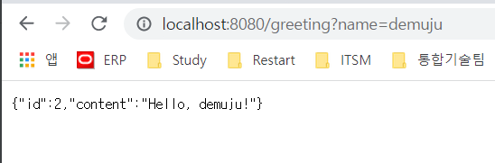

# 스프링부트를 사용하여 RESTful 웹서비스 만들기

## 무엇을 만들 것인가?

[http://localhost:8080/greeting](http://localhost:8080/greeting) HTTP GET Request를 받아

다음과 같이 JSON 응답을 하는 웹서비스를 만든다.

    {"id" : 1, "content" : "Hello, world!"}

다음과 같이 name 파라미터를 쿼리스트링으로 전달하면 해당 값을 리턴한다.

[http://localhost:8080/greeting?name=demoju](http://localhost:8080/greeting?name=demoju)

    {"id" : 1, "content" : "Hello, demoju!"}

---

## Starting With Spring initializr

[https:/start.spring.io](https:/start.spring.io) 에 접속하여 원하는 설정으로 선택한다.

다음과 같이 controller package 를 추가하고

    com.example.restservice.controller

Greeting.java 파일을 만든다.

    package com.example.restservice.controller;

    public class Greeting {
    
        private final long id;
        private final String content;
    
        public Greeting(long id, String content) {
            this.id = id;
            this.content = content;
        }
    
        public long getId() {
            return id;
        }
    
        public String getContent() {
            return content;
        }
    }

GreetingController 클래스 파일을 작성한다.

    package com.example.restservice.controller;
    
    import org.springframework.web.bind.annotation.GetMapping;
    import org.springframework.web.bind.annotation.RequestParam;
    import org.springframework.web.bind.annotation.RestController;
    
    import java.util.concurrent.atomic.AtomicLong;
    
    @RestController
    public class GreetingController {
    
        private static final String template = "Hello, %s!";
        private final AtomicLong counter = new AtomicLong();
        
        @GetMapping("/greeting")
        public Greeting greeting(@RequestParam(value = "name", defaultValue = "World") String name) {
            return new Greeting(counter.incrementAndGet(), String.format(template, name));
        }
    }

---
##결과 확인

[http://localhost:8080/greeting](http://localhost:8080/greeting) 

[http://localhost:8080/greeting?name=demuju](http://localhost:8080/greeting?name=demuju)

---
## 중요포인트
*@RestController* 어노테이션을 Controller 역할을 하는 클래스에 추가해주면, 

해당 Class에 속한 모든 메소드는 View 대신 Domain Object 를 리턴하여 준다.

다음과 같이 @Controller 과 @ResponseBody를 사용하여 RestAPI를 만드는 것보다 공수가 적게 든다!

    @Controller
    public class GreetingController {
    
        private static final String template = "Hello, %s!";
        private final AtomicLong counter = new AtomicLong();
    
        @GetMapping("/greeting")
        @ResponseBody
        public Greeting greeting(@RequestParam(value = "name", defaultValue = "World") String name) {
            return new Greeting(counter.incrementAndGet(), String.format(template, name));
        }
    }

